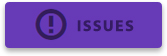

[](#)

[](https://travis-ci.org/FezVrasta/bootstrap-material-design)
[](https://gratipay.com/FezVrasta)
[](https://github.com/FezVrasta/bootstrap-material-design)


## About
Material Design for Bootstrap is a Bootstrap V3 compatible theme; it is an easy way to use the new [Material Design guidelines by Google](https://material.google.com/) in your Bootstrap 3 based application.
Just include the theme, after the Bootstrap CSS and include the JavaScript at the end of your document (just before the `</body>` tag), and everything will be converted to Material Design (Paper) style.

**NOTE**: This V3 compatible theme is still in development, it could be used on production websites but I can't guarantee compatibility with previous versions.

Check out [the demo at this link](http://fezvrasta.github.io/bootstrap-material-design/).

## V4 Development
The next major Bootstrap V4 compatible release of bootstrap-material-design is [in development](https://github.com/FezVrasta/bootstrap-material-design/tree/v4-dev).  Check out the [documentation](http://rosskevin.github.io/bootstrap-material-design/migration/) (temporary site url) for migration, getting started, development, and examples.  It has some requested implementations and more to come over V3.  There are a lot of great changes in V4, but be warned, both Bootstrap V4 and our own implementation is changing daily.  If you want to get involved, please do so by submitting pull requests.  Before undertaking any major PR effort, please check the [milestone](https://github.com/FezVrasta/bootstrap-material-design/milestones/V4) for an existing issue.  If there isn't one, please file a new issue and `cc: @rosskevin` so we can discuss and assign the work so effort is not duplicated.  Thank you!

Please prefix any issue or pull request title with `V4`.

Major differences:
- Customized bootstrap build with variables instead of being an addon theme
- ES6 Javascript classes
- SCSS
- New scalable documentation framework that mirrors Bootstrap's own
- Documentation includes Bootstrap reference pages to display default rendering
- New build/documentation process (also mimics Bootstrap's project setup)

## How to install

You may install this theme using NPM or Bower:

- NPM : `npm install bootstrap-material-design`
- Bower : `bower install bootstrap-material-design`

If you prefer, you can include this framework in your project using our official CDN:

- [Bootstrap Material Design on CDNJS.com](https://cdnjs.com/libraries/bootstrap-material-design)
- [Bootstrap Material Design on JSDelivr.com](http://www.jsdelivr.com/#!bootstrap.material-design)


## Getting started

Add the necessary links to your `<head>` element for fonts and stylsheets:
```html
  <!-- Material Design fonts -->
  <link rel="stylesheet" type="text/css" href="//fonts.googleapis.com/css?family=Roboto:300,400,500,700">
  <link rel="stylesheet" type="text/css" href="//fonts.googleapis.com/icon?family=Material+Icons">

  <!-- Bootstrap -->
  <link rel="stylesheet" type="text/css" href="//maxcdn.bootstrapcdn.com/bootstrap/3.3.7/css/bootstrap.min.css">

  <!-- Bootstrap Material Design -->
  <link rel="stylesheet" type="text/css" href="dist/css/bootstrap-material-design.css">
  <link rel="stylesheet" type="text/css" href="dist/css/ripples.min.css">
```

### Bower

Many use bower including compiling source for this project.  Here are a couple of things to know:

  1. When using SASS, `@import` directives cannot be interpolated.  Given the variety of configurations, the typical `bower_components` directory is occasionally in a different location.  Given the options, a `loadPath` was [added to the SASS compiler](https://github.com/FezVrasta/bootstrap-material-design/pull/762/files)
     so that bootstrap files could be loaded without specifying the path to the `bower_components` directory.  You may similarly need to add a load path to your compiler.  It is still debatable if this is for the greater good, but seems like the only
     way to accommodate multiple configurations.
  2. This project will install both `bootstrap` and `bootstrap-sass` in `bower_components`.  Each is used for the LESS and SASS version compilation respectively.   If you are only using one, feel free to [ignore the other bower dependency](https://stackoverflow.com/a/27791606/2363935).

## Support and Contributions

All issues filed should be reduced to a [CodePen](http://codepen.io/rosskevin/pen/VvRgrN) test case where possible. Please see the [CONTRIBUTING.md](CONTRIBUTING.md) file.

If you like this project you may support it by donating via Gittip, starring this repository or reporting issues.

[](https://www.gratipay.com/FezVrasta/)
[](https://github.com/FezVrasta/bootstrap-material-design/issues)


## Development

We are using Grunt to automate the workflow and build process. Ensure you have nodejs installed and grunt-cli installed globally.
After cloning the repo, run `npm install && bower install` to ensure you have all dev dependencies.

### Grunt

- `grunt build` - run the tests and compile the less/sass. See [Gruntfile.js](Gruntfile.js) for details on targets.
- `grunt test` - browser-based Jasmine unit tests.
- `grunt serve` - build and fire up an http server with live-reload and a watch for development purposes.

### LESS & SASS

The bootstrap 3.x compatible version (master) is developed using LESS, with an automated conversion to SASS.

The upcoming 4.x compatible version is being actively developed using SASS on the `v4-dev` branch.


## Documentation

Material Design ([spec](https://material.google.com/)) for Bootstrap provides 
styles for bootstrap based markup to comply with Material Design concepts.


### Customization

#### Colors

There are 17 color variations (in addition to the classic 4 variations) described by the Material Design color palette:


##### Compile your customized distributable

If you are using the static css files, you may want to use your own color variation.  To do so:

1. `npm install && bower install` (alternatively you may download the source, but using npm and bower is recommended)
2. Edit the `less/_variables.less` file and alter the color variables.  You are most likely interested in altering `@brand-primary`.  For a list of material design color palette variables, refer to `less/_colors.less`

    ```less
    @brand-primary: @teal;
    @brand-success: @green;
    @brand-danger: @red;
    @brand-warning: @deep-orange;
    @brand-info: @light-blue;
    ```
3. Compile and test your distributable css by running `grunt serve`, this will launch your browser to the test site.  Peruse and verify your color choices
4. From your application, you may now reference the compiled css files in `dist/css`
    
##### Customize via less variables

If you are referencing source from your own application's less file, you may simply customize the colors by redefining the color variables _after_ including bootstrap-material-design.  See above for a description of variables.  
    
### Forms

All inputs should be surrounded by a standard `.form-group`, and as such `material.js` will enforce this.  The `.form-group` is
used to signal different input styles and variations.  See the examples for variations.

#### Sizing

In general, it is preferred that sizing be altered with either `.form-group-sm` or `.form-group-lg`.  Due to the interconnected
nature of inputs, labels, margins and padding, `material.js` will convert any use of `.input-sm` or `.input-lg` to 
`.form-group-sm` or `.form-group-lg` in order to reduce the necessary markup/variations and get a standard sizing with
fewer side effects.

#### Buttons

Buttons are flat by default, without shadows.  Add `.btn-raised` to a button to add a permanent shadow to it.  See the [button examples](http://fezvrasta.github.io/bootstrap-material-design/bootstrap-elements.html#buttons) 

#### Inputs

##### Labels

The following classes should be placed on the `.form-group` to indicate the label style:

- `.label-floating` - renders label as a placeholder, that animates above the field upon focus
- `.label-static` - renders label above the field. `input placeholder` attribute can also be used in conjunction
- `.label-placeholder` - renders a label as a placeholder only 
- no label, but use of `input placeholder` attribute - same rendering as `.label-placeholder`

##### Hints

Upon focus, a hint can be displayed.  Use any `p | span` with `.help-block`.


##### Examples

```html
  <div class="form-group label-static">
    <label for="i2" class="control-label">label-static</label>
    <input type="email" class="form-control" id="i2" placeholder="placeholder attribute">
    <p class="help-block">This is a hint as a <code>p.help-block.hint</code></p>
  </div>

  <div class="form-group label-floating">
    <label for="i5" class="control-label">label-floating</label>
    <input type="email" class="form-control" id="i5">
    <span class="help-block">This is a hint as a <code>span.help-block.hint</code></span>
  </div>

  <div class="form-group label-placeholder">
    <label for="i5p" class="control-label">label-placeholder</label>
    <input type="email" class="form-control" id="i5p">
    <span class="help-block">This is a hint as a <code>span.help-block.hint</code></span>
  </div>
```


#### Radio, Checkbox, Toggle

Be sure to inspect the source of the demos to find proper markup examples. Remember to use the proper HTML markup.

Radio example:

```html
<div class="form-group">
  <label class="col-lg-2 control-label">Radios</label>

  <div class="col-lg-10">
    <div class="radio radio-primary">
      <label>
        <input type="radio" name="optionsRadios" checked="">
        Option one
      </label>
    </div>
    <div class="radio radio-primary">
      <label>
        <input type="radio" name="optionsRadios">
        Option two
      </label>
    </div>
  </div>
</div>
```      
        
        

### Icons

Bootstrap Material Design supports the full range of original Material Design icons!
[See the full set of material design icons at the material icons library.](https://www.google.com/design/icons/)

It’s easy to incorporate icons into your web page. [Here’s an example](http://fezvrasta.github.io/bootstrap-material-design/bootstrap-elements.html#icon): 
```
<i class="material-icons">face</i> face
```

Please be sure that the fonts are properly setup, see [Getting Started](#getting-started).

### Cards 

A card will expand to fill all of the available width (e.g. column's width). Card's height will be automatically resized to match width.

Here is an example on how to use it:

```html
<div class="card">

    <div class="card-height-indicator"></div>

    <div class="card-content">

        <div class="card-image">
            
            <h3 class="card-image-headline">Lorem Ipsum Dolor</h3>
        </div>

        <div class="card-body">
            <p>Lorem Ipsum is simply dummy text of the printing and typesetting industry.</p>
        </div>

        <footer class="card-footer">
            <button class="btn btn-flat">Share</button>
            <button class="btn btn-flat btn-warning">Learn More</button>
        </footer>

    </div>

</div>
```    
    
Cards will adapt to column's width. The card below will have width equal to col-lg-6:

```html
<div class="row">
    <div class="col-lg-3"></div>

    <div class="col-lg-6">
        <div class="card">
            ...
        </div>
    </div>

    <div class="col-lg-3"></div>
</div>
```

## material.js

`material.js` is a jQuery plugin that adds some magic to your markup and allows Material Design for Bootstrap to style some elements like inputs, checkboxes, radios etc.

### Functions

* `$.material.init()` - shortcut to run all the following commands:
* `$.material.ripples()` will apply ripples.js to the default elements.
* `$.material.input()` will enable the MD style to the text inputs, and other kind of inputs (number, email, file etc).
* `$.material.checkbox():` will enable the MD style to the checkboxes (remember to follow the markup guidelines explained in the [Inputs section](#inputs).
* `$.material.radio():` will enable the MD style to the checkboxes (remember to follow the markup guidelines explained in the Inputs section.

### Apply only to specific elements

Every function expects an optional value that will be used as a selector for the function; for example,
`$.material.ripples("#selector, #foobar")` will apply Ripples.js only to `#selector` and `#foobar`.
The functions that allows an optional selector are `$.material.ripples`, `$.material.input`, `$.material.checkbox` and `$.material.radio`.

You can even override the default values using the `$.material.options` function. The default values are:

```javascript
$.material.options = {
    "withRipples": ".btn:not(.btn-link), .card-image, .navbar a:not(.withoutripple), .nav-tabs a:not(.withoutripple), .withripple",
    "inputElements": "input.form-control, textarea.form-control, select.form-control",
    "checkboxElements": ".checkbox > label > input[type=checkbox]",
    "radioElements": ".radio > label > input[type=radio]"
}
```    

### Arrive.js support

If you need to dynamically add elements to your DOM then you may need to include [`Arrive.js`](https://github.com/uzairfarooq/arrive) before `Material.js`. This will automatically apply `material.js` to every new element added via JavaScript.

## Plugins

Material Design for Bootstrap comes with styling support for various external scripts:

### SnackbarJS

Create snackbars and toasts with the [SnackbarJS plugin](https://github.com/FezVrasta/snackbarjs). The default toast style is the squared one (snackbar style). If you like to use the rounded style (toast style), please add the `toast` class to the `style` option of SnackbarJS.

### RipplesJS

This is part of the Material Design for Bootstrap project and is a plain JavaScript script which creates the ripple effect when clicking on the specified elements.
At the moment RipplesJS does not have its own repository but it will probably have one in the future.

You may want to set a custom color to the ripples of a specific element, to do so write:

```html
<button class="btn btn-default" data-ripple-color="#F0F0F0">Custom ripple</button>
```

### noUiSlider

Make cross-browser sliders and get them styled with Material Design thanks to the support provided by this theme.
Read more about [noUiSlider here](http://refreshless.com/nouislider/).

### Dropdown.js

Finally a dropdown plugin that transforms select inputs in nice dropdowns and does not drive you crazy.
Read more about [Dropdown.js here](https://github.com/FezVrasta/dropdown.js).

### Selectize.js

Transform select and multi-select inputs into advanced text inputs. Material Design for BS provides a full replacement of the plugin's CSS, so don't include it.
Read more about [selectize.js](http://brianreavis.github.io/selectize.js/).

### Bootstrap Material Datepicker

A Material Design datepicker created to be used with Material Design for Bootstrap.  
Read more about [Bootstrap Material Datepicker](https://github.com/T00rk/bootstrap-material-datepicker)

## Compatibility

Currently, Material Design for Bootstrap supports Google Chrome (tested v37+), Mozilla Firefox (tested 30+), and Internet Explorer (tested 11+). Mobile browsers are not currently tested but they may work.


## License
[MIT License](LICENSE.md) 
