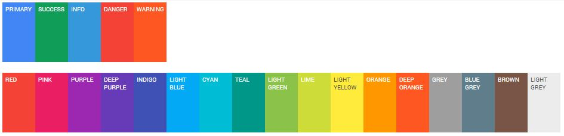

Material Design for Bootstrap
=========================

This Bootstrap theme is an easy way to use the new Material Design guidelines by Google in your Bootstrap 3 based application.
Just include the theme right after the Bootstrap CSS and include the javascript at the end of your document, everything will be converted to Material Design (paper) style.

This theme is in early development and is not ready for production.

Check out [the demo at this link](http://fezvrasta.github.io/bootstrap-material-design/).

## How to install

    bower install bootstrap-material-design --save

## Features

Currently supported elements:

- Input fields (text, numeric, email, etc)
- Textarea
- Buttons (ripple effect working)
- Select
- Navbar
- Button groups
- Input groups
- Checkbox
- Radio
- Alerts
- Progress bars
- Jumbotron
- Wells
- Dialogs
- Lists

Todo elements:

- Morphing icons
- [Icons/grids/chips to card/fullscreen transitions](http://www.polymer-project.org/components/core-animated-pages/demo.html)
- [Headers](http://www.polymer-project.org/components/core-header-panel/demo.html)
- [Icon button](http://www.polymer-project.org/components/paper-icon-button/demo.html)
- [Tabs](http://www.polymer-project.org/components/paper-tabs/demo.html)
- [Toggle buttons](http://www.polymer-project.org/components/paper-toggle-button/demo.html)

I'll try to write every component without the need of Javascript but just CSS, and use JS only if strictly needed.

# Support me

If you like this project you may support me by donating something on Gittip, starring this repository or reporting bugs and ideas in the issue section.

# Documentation

Material Design for Bootstrap provides some additional stuff to get the best from Material Design.

### Variations:

There are 17 additional color variations (in addition to the classic 4 variations) for buttons, inputs, checkboxes, radios, alerts, navbars, tabs, labels, paginations, progress bars and more.
They can be used by adding the class suffix `-material-color` to the desired element and replacing `color` with the desired one.

Example:

    <button class="btn btn-material-deeppurple">Deep purple button</button>

These colors are taken from the Material Design color palette and are reported below:

### Buttons:

Add `.btn-flat` to a button to make it flat, without shadows.
Add `.btn-raised` to a button to add a permanent shadow to it.

### Inputs:

Add `.floating-label` to an input field with a `placeholder` to transform the placeholder in a floating label.

Remember to use the proper HTML markup to get radio and checkboxes styled correctly (choose between *radio* or *checkbox*):

    

        <label>
            <input type="radio/checkbox" checked>
            Option one is this
        </label>
    

### Icons:

Material Design for Bootstrap includes 490 original Material Design icons!
These icons are extracted from the original Google sources and are licensed under the BSD license.
They are provided as an iconic and easy to use font.

Variations are available for every icon, including the original Bootstrap icons.

The syntax to add a Material icon is:

     <i class="icon icon-material-favorite"></i>

# Plugins

Material Design for Bootstrap comes with styling support for various external scripts. At the moment only two scripts are supported but others will come:

### SnackbarJS

Create snackbars and toasts with [SnackbarJS plugin](https://github.com/FezVrasta/snackbarjs). The default toast style is the squared one (snackbar style). If you like to use the rounded style (toast style), please add the `toast` class to the `style` option of SnackbarJS.

### RipplesJS

This is part of Material Design for Bootstrap project and is a plain Javascript script which creates the ripple effect on click of the defined elements.
At the moment RipplesJS does not have its own repository but it will probably have one in the future.

### noUiSlider

Make cross-browser sliders and get them styled with Material Design thanks to the support provided by this theme.
Read more about [noUiSlider here](http://refreshless.com/nouislider/)

# Compatibility

Currently Material Design for Bootstrap supports Google Chrome (tested v37+), Mozilla Firefox (tested 30+), and Internet Explorer (tested 11+). Mobile browsers are not currently tested but it may work.

